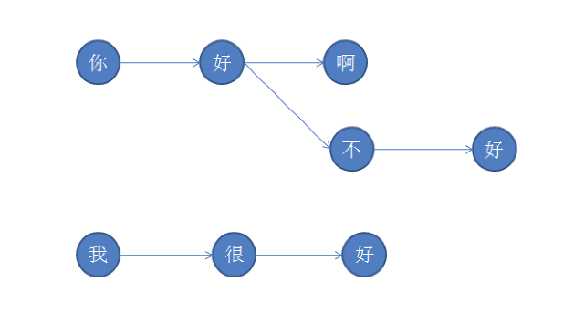

# 敏感词过滤

敏感词过滤是互联网应用上很常见的一个场景，比如聊天会话、分享内容等，包含不文明用语、政治敏感用语、商业敏感用语的，都需要屏蔽。敏感词库往往比较大，过滤处理的性能不能太低。DFA(Deterministic Finite Automaton 确定有穷自动机)算法是比较常用的一种算法。

DFA算法的核心是通过事件和当前的状态得到下一个状态。对于敏感词过滤应用来说，其实是比较简单的一个应用场景，因为其状态转换可以是树形结构，不会出现环状结构。而且状态转换也不用特别的计算，仅仅是查询。

举例：有敏感词“你好”、“你好啊”、“你好不好”、“我很好”，其状态转换关系为：

这样就可以将敏感词库构建树的结构，判断一个词是否为敏感词时匹配范围就比较小。比如要判断“你好”，根据第一个字我们就可以确认需要检索的部分。

特别需要处理的是敏感词的结束，需要设置专门的标识位。如上图中，敏感词“你好”就必须有标记位才能确定该词。

本工程是用clojure实现的一个过滤词算法。
